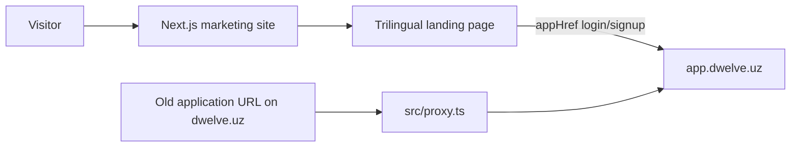

# Marketing Site Architecture

## System boundary

This repository renders the public Dwelve site only. It does not own product
data, authentication, or authorization and currently sends no backend requests.

## Rendering and state

- `src/app/(landing)/page.tsx` is the sole page and composes the landing
  sections in document order.
- Landing sections are client components where i18n, motion, scroll state, or
  the Three.js hero requires browser APIs.
- `src/app/providers.tsx` initializes i18next language persistence,
  class-based themes, and a React Query provider.
- Language and theme are the only meaningful persistent client state:
  `localStorage["gf-language"]` and `localStorage["dwelve-theme"]`.
- React Query and backend helpers remain from the pre-split application but have
  no active marketing consumer. They are residue, not the approved data layer
  for a hypothetical future form.

## Main modules

| Location | Responsibility |
|---|---|
| `src/app/(landing)/_sections` | Page sections and illustrative product mockups |
| `src/app/(landing)/_components` | Landing-only navbar, footer, hero, headings, bullets |
| `src/components/ui/Button.tsx` | Shared button/link variants, including marketing brand variants |
| `src/components/ui/Surface.tsx` | Shared bordered surface recipe |
| `src/components/Custom/DwelveLogo.tsx` | Canonical rendered mark |
| `src/i18n/messages/{en,ru,uz}.ts` | Translation catalogs |
| `src/lib/hosts.ts` | Configurable authenticated-app origin |
| `src/lib/seo.ts` | Canonical marketing origin and metadata copy |
| `src/lib/seo-routes.ts` | Indexable and redirected route registries |
| `src/proxy.ts` | Cross-host compatibility redirect |

## Dependency responsibilities

- Next.js/React: routing, metadata, rendering, fonts.
- Tailwind and `globals.css`: layout utilities and design tokens.
- i18next/react-i18next: runtime trilingual copy.
- Motion: section reveals, nav indicator, and reduced-motion-aware interaction.
- Three.js: the illustrative hero scene only.
- Radix accordion: accessible FAQ disclosure behavior.
- next-themes: light/dark class selection.

Several installed packages and shared source files are not reachable from the
current route. Do not document them as active architecture merely because they
remain in `package.json` or `src/`.

## Errors and observability

- `src/app/not-found.tsx` owns unknown routes.
- `src/app/global-error.tsx` is the root client error boundary and logs to the
  browser console.
- No application analytics, telemetry service, or error-monitoring integration
  is implemented.

## Known gaps

- There is no first-party test suite.
- The application-era catalogs, providers, utilities, components, and
  dependencies have not yet been reduced to the marketing dependency graph.
- No supported server-side lead/contact form exists; support links use email.
