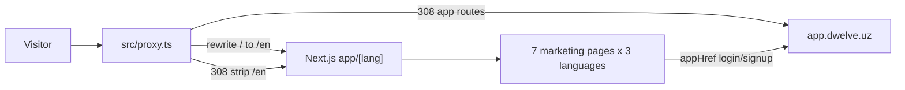

# Marketing Site Architecture

## System boundary

This repository renders the public Dwelve site only. It does not own product
data, authentication, or authorization and currently sends no backend requests.

## Rendering and state

- `src/app/[lang]/layout.tsx` is the root layout. There is no
  `src/app/layout.tsx`: every route lives under the language segment, which is
  what makes `lang` a root parameter and lets server code resolve copy without
  prop drilling.
- `src/proxy.ts` decides the language before anything renders — rewrite for the
  unprefixed default, 308 for `/en/...`, 308 to the app for old product URLs.
- `src/app/[lang]/(landing)/page.tsx` composes the home sections in document
  order; the other four pages sit beside it in the same route group and share its
  navbar and footer through the group layout.
- Pages are client components where i18n, motion, scroll state, or the Three.js
  scenes need browser APIs. `/privacy` and `/terms` are server components and
  ship no JavaScript of their own.
- Every route (5 pages x 3 languages, plus the generated files) is prerendered at
  build time via `generateStaticParams`, with `dynamicParams = false` so an
  unknown language segment is a routing-level 404 rather than a `notFound()`
  thrown inside a segment.
- `src/app/global-not-found.tsx` serves every unmatched URL. It bypasses all
  layouts by design — see `docs/web/SEO_AND_ROUTES.md` for why that is the only
  option here, and what it costs.
- `src/app/[lang]/providers.tsx` initializes i18next **from the URL**, class-based
  themes, and a React Query provider.
- Theme is now the only meaningful persistent client state
  (`localStorage["dwelve-theme"]`). The old `localStorage["gf-language"]`
  preference was removed: with language in the URL it would let one URL show two
  different contents and contradict that page's own canonical.
- The React Query provider and query-key/refresh helpers remain from the
  pre-split application but have no active marketing data consumer. The old
  backend transport, safe-action, upload, and date helpers have been removed.
  Remaining query infrastructure is residue, not the approved data layer for a
  hypothetical future form.

## Main modules

| Location                               | Responsibility                                                  |
| -------------------------------------- | --------------------------------------------------------------- |
| `src/app/[lang]/(landing)/_sections`   | Home-page sections and illustrative product mockups             |
| `src/app/[lang]/(landing)/_components` | Shared marketing chrome: navbar, footer, hero scenes, page header, closing CTA |
| `src/app/[lang]/(landing)/<page>`      | One marketing page each: pricing, about, contact, privacy, terms |
| `src/app/fonts.ts`                     | The four font faces, shared by the root layout and the global 404 |
| `src/app/global-not-found.tsx`         | Server-rendered 404 for every unmatched URL                      |
| `src/i18n/server.ts`                   | Catalog reads from Server Components                            |
| `src/lib/page-metadata.ts`             | Per-page, per-language metadata and JSON-LD                     |
| `src/lib/routing.ts`                   | Client-side language and localized-href helpers                 |
| `src/components/ui/Button.tsx`         | Shared button/link variants, including marketing brand variants |
| `src/components/ui/Surface.tsx`        | Shared bordered surface recipe                                  |
| `src/components/Custom/DwelveLogo.tsx` | Canonical rendered mark                                         |
| `src/i18n/messages/{en,ru,uz}.ts`      | Translation catalogs                                            |
| `src/lib/hosts.ts`                     | Configurable authenticated-app origin                           |
| `src/lib/seo.ts`                       | Canonical origin and shared robots/social constants             |
| `src/lib/seo-routes.ts`                | Route registries, localized paths, `hreflang` sets              |
| `src/proxy.ts`                         | Language routing and cross-host compatibility redirects         |

## Dependency responsibilities

- Next.js/React: routing, metadata, rendering, fonts.
- Tailwind and `globals.css`: layout utilities and design tokens.
- i18next/react-i18next: runtime trilingual copy.
- Motion: section reveals, nav indicator, and reduced-motion-aware interaction.
- Three.js: the two hero scenes only — the marked answer sheet (`HeroScene`)
  and the shader field behind it (`HeroField`).
- Radix accordion: accessible FAQ disclosure behavior.
- next-themes: light/dark class selection.

Several installed packages and shared source files are not reachable from the
current route. Do not document them as active architecture merely because they
remain in `package.json` or `src/`.

## Errors and observability

- `src/app/not-found.tsx` owns unknown routes.
- `src/app/global-error.tsx` is the root client error boundary and logs to the
  browser console.
- No application analytics, telemetry service, or error-monitoring integration
  is implemented.

## Known gaps

- There is no first-party test suite.
- The application-era catalogs, React Query provider/helpers, some components,
  dependencies, and `next.config.ts` settings/upload comments have not yet been
  fully reduced to the marketing dependency graph.
- No supported server-side lead/contact form exists; support links use email.
